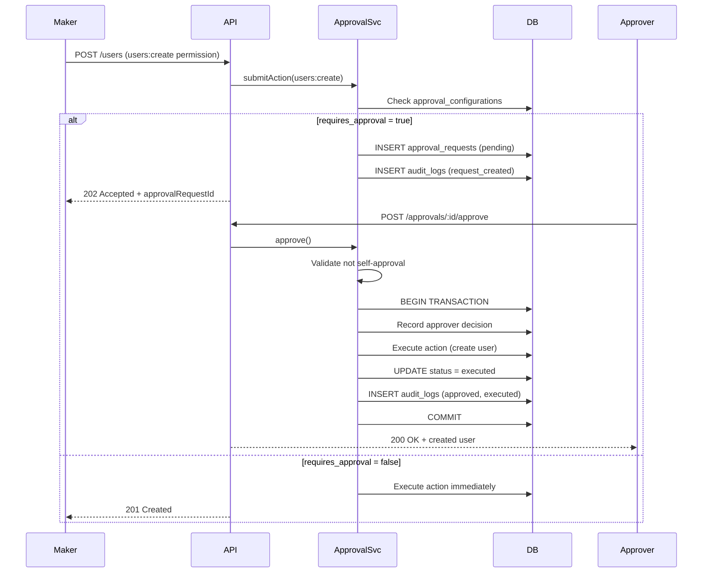

# System Architecture

## Overview

This RBAC backend implements **permission-based authorization** with a **Maker-Approver workflow** for sensitive operations. Authorization is enforced by permission names (e.g. `users:create`), not role names alone.

## Architecture Diagram

```
┌─────────────────────────────────────────────────────────────────────────┐
│                           Client (REST API)                             │
└─────────────────────────────────┬───────────────────────────────────────┘
                                  │ HTTPS + JWT Bearer
                                  ▼
┌─────────────────────────────────────────────────────────────────────────┐
│                         Express.js Application                          │
│  ┌──────────┐  ┌────────────┐  ┌─────────────┐  ┌──────────────────┐  │
│  │  Helmet  │→ │    Auth    │→ │  Authorize  │→ │    Controller    │  │
│  │   CORS   │  │ Middleware │  │ (Permission)│  │                  │  │
│  └──────────┘  └────────────┘  └─────────────┘  └────────┬─────────┘  │
│                                                           │             │
│                                                           ▼             │
│  ┌──────────────────────────────────────────────────────────────────┐   │
│  │                         Service Layer                            │   │
│  │  ┌────────────┐  ┌──────────────┐  ┌────────────┐  ┌──────────┐  │   │
│  │  │ AuthService│  │ UserService  │  │  Approval  │  │  Audit   │  │   │
│  │  │            │  │              │  │  Service   │  │ Service  │  │   │
│  │  └────────────┘  └──────┬───────┘  └─────┬──────┘  └──────────┘  │   │
│  │                           │                │                       │   │
│  │                           ▼                ▼                       │   │
│  │                    ┌──────────────────────────────┐                │   │
│  │                    │    Action Executor Service   │                │   │
│  │                    │  (Transactional Execution)   │                │   │
│  │                    └──────────────────────────────┘                │   │
│  └──────────────────────────────────────────────────────────────────┘   │
│                                                           │             │
│  ┌────────────────────────────────────────────────────────┴───────────┐ │
│  │                      Repository Layer (MySQL)                      │ │
│  └────────────────────────────────────────────────────────────────────┘ │
└─────────────────────────────────────────────────────────────────────────┘
                                  │
                                  ▼
┌─────────────────────────────────────────────────────────────────────────┐
│                              MySQL 8.0+                                 │
│  users │ roles │ permissions │ role_permissions │ user_roles           │
│  approval_configurations │ approval_requests │ approval_request_approvers│
│  audit_logs                                                             │
└─────────────────────────────────────────────────────────────────────────┘
```

## Request Flow: Maker-Approver Pattern



## Layer Responsibilities

| Layer | Responsibility |
|-------|----------------|
| **Routes** | HTTP mapping, middleware chain composition |
| **Controllers** | Request/response handling, status codes |
| **Services** | Business logic, workflow orchestration |
| **Repositories** | Data access, SQL queries |
| **Middleware** | Cross-cutting: auth, authorization, validation |

## RBAC Model

```
User ──(N:M)──► Role ──(N:M)──► Permission
```

- A user can have multiple roles.
- A role can have multiple permissions.
- API endpoints check **permissions**, not role names.
- Role names (Admin, Maker, Approver, User) are labels; access is granted via assigned permissions.

## Maker-Approver Rules

1. **Configurable per action** via `approval_configurations.requires_approval`.
2. **Self-approval blocked** — `requested_by` cannot equal the approver.
3. **Multi-approver ready** — `min_approvers` and `approval_request_approvers` table support N-of-M approval.
4. **Transactional execution** — approval + execution happen in a single DB transaction.
5. **Full audit trail** — every state transition is logged.

## Folder Structure

```
src/
├── app.js                    # Express app setup
├── server.js                 # Entry point
├── config/
│   ├── index.js              # Environment config
│   └── database.js           # MySQL pool + transactions
├── constants/
│   └── permissions.js        # Permission & action constants
├── controllers/              # HTTP handlers
├── middleware/
│   ├── auth.js               # JWT authentication
│   ├── authorize.js          # Permission-based RBAC
│   ├── validate.js           # Joi validation
│   └── errorHandler.js
├── repositories/             # Data access layer
├── routes/                   # Route definitions
├── services/
│   ├── actionExecutor.service.js  # Executes approved actions
│   ├── approval.service.js        # Maker-Approver workflow
│   ├── audit.service.js
│   ├── auth.service.js
│   └── user.service.js
├── utils/
└── validators/
```

## Extensibility

- **New permissions**: Add to `permissions` table, assign to roles, protect routes with `authorize()`.
- **New approval actions**: Register handler in `actionExecutor.service.js`, add config row.
- **Multiple approvers**: Set `min_approvers > 1` in `approval_configurations`; logic already accumulates decisions.
